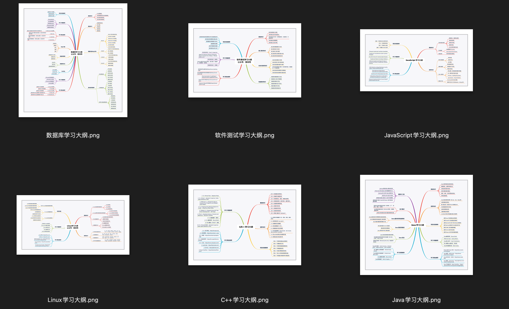

## ChatGPT编程路线图

最近开始使用ChatGPT作为自己编程助手，作为先进的大语言模型，彻底改变了编写代码的方式。您可以通过自然语言与ChatGPT进行互动，它可以为您提供定制的学习材料，帮助您根据自己的技能水平和学习进度进行学习。检索解决方案，排查代码错误，给出示例代码，甚至可以跟着它学习一门新语言。使学习变得更加有趣和具有互动性。

学习编程的第一步，就是要有一个合理详细的路线，以前需要各种检索，也不一定能找到一个全面的路线图，现在有了ChatGPT，就交给它吧。

**欢迎关注我的公众号以及知识星球，获取更多编程资料、ChatGPT使用技巧、相关副业案例。**

## 编程路线图

### Python学习路线

[Python学习路线.md](编程路线图/Python学习路线.md)

[Python学习路线.xmind](编程路线图/Python学习大纲.xmind)

### Java学习路线

[Java学习路线.md](编程路线图/Java学习路线.md)

[Java学习大纲.xmind](编程路线图/Java学习大纲.xmind)

### JavaScript学习路线

[JavaScript学习路线.md](编程路线图/JavaScript学习路线.md)

[JavaScript学习大纲.xmind](编程路线图/JavaScript学习大纲.xmind)

### Linux学习路线

[Linux学习路线.md](编程路线图/Linux学习路线.md)

[Linux学习大纲.xmind](编程路线图/Linux学习大纲.xmind)

### C/C++学习路线

[C/C++学习路线.md](编程路线图/C/C++学习路线.md)

[C++学习大纲.xmind](编程路线图/C++学习大纲.xmind)

### 数据库学习路线

[数据库学习路线.md](编程路线图/数据库学习路线.md)

[数据库学习大纲.xmind](编程路线图/数据库学习大纲.xmind)

### 软件测试学习路线.md

[软件测试学习路线.md](编程路线图/软件测试学习路线.md)

[软件测试学习大纲.xmind](编程路线图/软件测试学习大纲.xmind)

